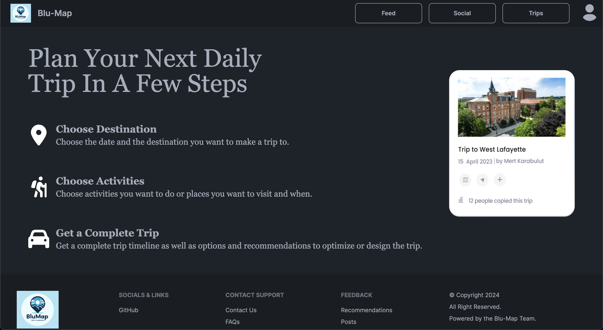

# Blu-Map

Blu-Map is a comprehensive travel planning web application that allows users to create, share, and browse travel itineraries. It leverages various modern web technologies to provide a seamless and engaging user experience.

## Features

- **Itinerary Creation**: Users can create detailed travel itineraries, adding events, attractions, restaurants, hotels, and transportation options.
- **Social Features**: Follow, like, and share itineraries with other users. Upload and display trip images in the social tab.
- **Travel Planning**: Adjust event itineraries with personalized recommendations based on locational preferences.
- **User Authentication**: Secure user sign-up and login using Auth0.
- **Google Maps Integration**: Utilize Google Maps Places API for trip recommendations.
- **Admin Dashboard**: Manage user accounts, moderate content, and access analytics and insights.

## Technologies Used

- **Frontend**: JavaScript, HTML/CSS, React, Next.js, Tailwind CSS
- **Backend**: Node.js, Express.js
- **Database**: PostgreSQL with Sequelize ORM
- **Authentication**: Auth0
- **Storage**: AWS S3 for user images
- **Caching**: Redis
- **Testing**: Jest
- **Containerization**: Docker
- **CI/CD**: GitHub workflows

## Overview

Blu-Map was developed over a span of four months using the SCRUM framework. The application features a robust and user-friendly interface that allows users to plan their trips efficiently. Key functionalities include itinerary creation, social sharing features, and personalized recommendations powered by Google Maps Places API.

The backend is supported by PostgreSQL for data management, with Sequelize ORM facilitating database interactions. AWS S3 is used for storing user images, while Redis enhances performance through effective caching. Docker is employed for containerization, ensuring seamless deployment across different environments. GitHub workflows and Jest are used for continuous integration and automated testing, maintaining high code quality and reliability.

_Please note: The application is not currently deployed due to upkeep costs. However, the code is available for review and local deployment._
